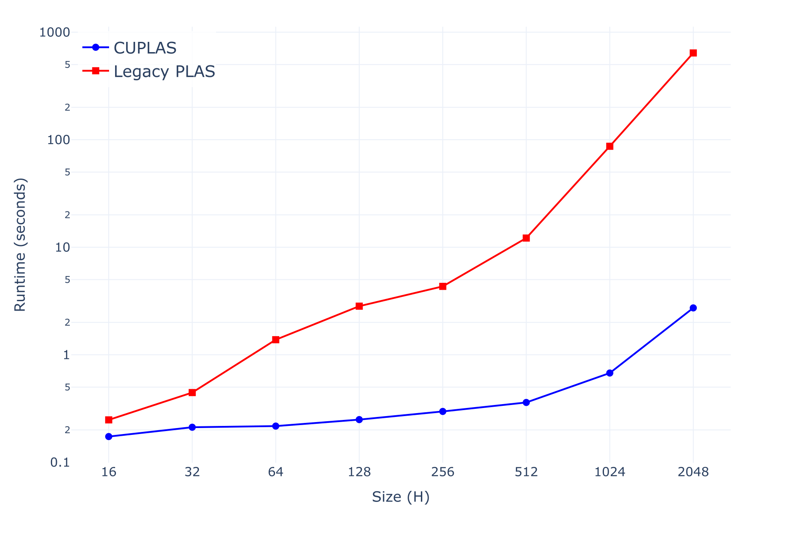

# CUDA Parallel Linear Assignment Sorting (CUPLAS)
This is a CUDA implementation of the Parallel Linear Assignment Sorting ([PLAS](https://github.com/fraunhoferhhi/PLAS)) algorithm, originally brought onto the GPU via pytorch.
It constitutes for large grids a speedup of over 100x compared to the original implementation while incurring a negligibly worse sorting quality.

## Performance Comparison

Evaluate the runtime of PLAS over the side length of a 2D grid with 3 layers:

```bash
python bench/eval_plas_runtime_over_size.py
```

These values were measured with an *NVIDIA RTX 5000 Ada Generation Laptop GPU*:



Only slight quality decrease:


## Usage

The API is the same as in [PLAS](https://github.com/fraunhoferhhi/PLAS).