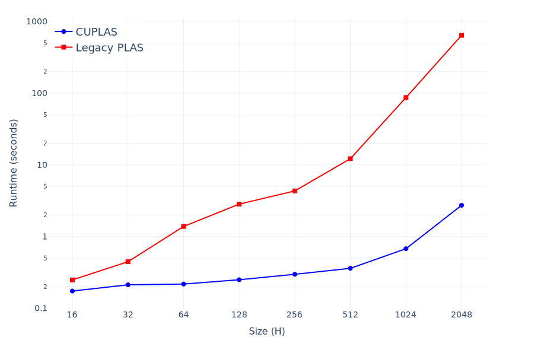
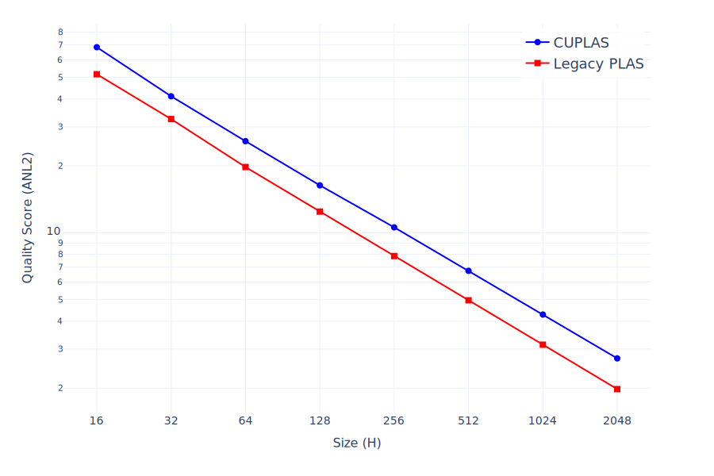

# CUDA Parallel Linear Assignment Sorting (CUPLAS)

[](https://chrishelms.me/projects/cuplas) [](https://arxiv.org/html/2312.13299v2)

This is a CUDA redesign of the Parallel Linear Assignment Sorting ([PLAS](https://github.com/fraunhoferhhi/PLAS)) algorithm, originally brought onto the GPU via pytorch.
It constitutes for large grids a speedup of over 100x compared to the original implementation while incurring an acceptable sorting quality decrease.

## Setup
**Installation as submodule** into external environment with uv:
```bash
git submodule add https://github.com/christian-helms/CUPLAS.git &&
uv pip install CUPLAS
```

**Development setup:**
```bash
git clone https://github.com/christian-helms/CUPLAS.git && cd CUPLAS &&
uv venv && uv sync --extra benchmark
```

### Tested on the following system:
- GPU: RTX 5090
- CUDA Toolkit: 12.9
- OS: Ubuntu 24.04 LTS

## Usage Example
```python
import torch
import plas

grid = torch.randn(1337, 1337, 3, device="cuda")
sorted_grid, sorted_index = plas.sort_with_plas(grid)
```


## Performance Comparison

Evaluate the runtime of PLAS over the side length of a 2D grid with 3 layers:

```bash
python bench/eval_plas_runtime_over_size.py
```

These values were measured with an *NVIDIA RTX 5090*:



Only slight quality decrease:



## API
The Python entry point is the `plas` module, which wraps the CUDA/C++ extension defined in `plas.cuplas`. The module currently exposes a single user-facing function:

### `sort_with_plas`
```
plas.sort_with_plas(
    grid: torch.Tensor,
    grid_target: torch.Tensor = torch.empty(0),
    seed: int = 1337,
    permuter_type: str = "lcg",
    min_block_side: int = 4,
    min_filter_side_length: int = 2,
    filter_decrease_factor: float = 0.9,
    improvement_break: float = 1e-5,
    min_group_configs: int = 3,
    max_group_configs: int = 10
) -> tuple[torch.Tensor, torch.Tensor]
```
- `grid` must be a CUDA tensor shaped `(H, W, C)` with `dtype=torch.float32`; the function allocates new output tensors and leaves the input untouched.
- Returns `(grid_output, index_output)` where `grid_output` matches `grid` and `index_output` is an `(H, W)` tensor of `torch.int32` mapping each sorted location back to its source.
- `grid_target` lets you provide a reference grid of the same shape as `grid` as a sorting target. This can be useful for sorting video frames based on the previous frame. Not passing it disables it and only uses an implicit target, which is a smoothed version of the current partially sorted image. 
- `permuter_type` can be either 'lcg' or 'philox'
- The block/filter parameters let you trade sorting quality against runtime.

This API assumes CUDA tensors live on the currently selected device (`torch.cuda.current_device()`); call `plas.sort_with_plas` inside a `with torch.cuda.device(dev)` context if you manage multiple GPUs. All tensor arguments must be contiguous; call `.contiguous()` beforehand if you slice or permute inputs.
